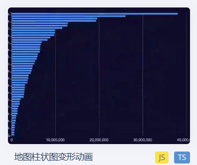
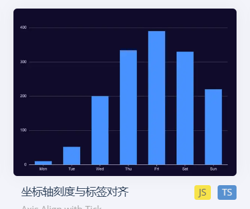

首页最右边第一个图不适合展现 时间-游客数量 这个数据  
使用该图展示两个维度的数据过于单调,而且OHLC图不适合展示旅游类数据    
建议使用堆叠条形图  

你说的有道理，这个OHLC确实不太合适
但是这个堆叠条形图会变化成地图的呀，放在首页是否有些许不妥

感觉这个图好一点，展示的就是过去一年，热点旅游地的排序
x轴为著名旅游景点名，y轴代表热度，单位百万，比如过去一年，长城有200w热度
如果可以的话就按这个来吧

最后说一下，我给的ps图是那么排，但实际布局肯定情况有变化，所以布局你可以按你自己觉得的来
