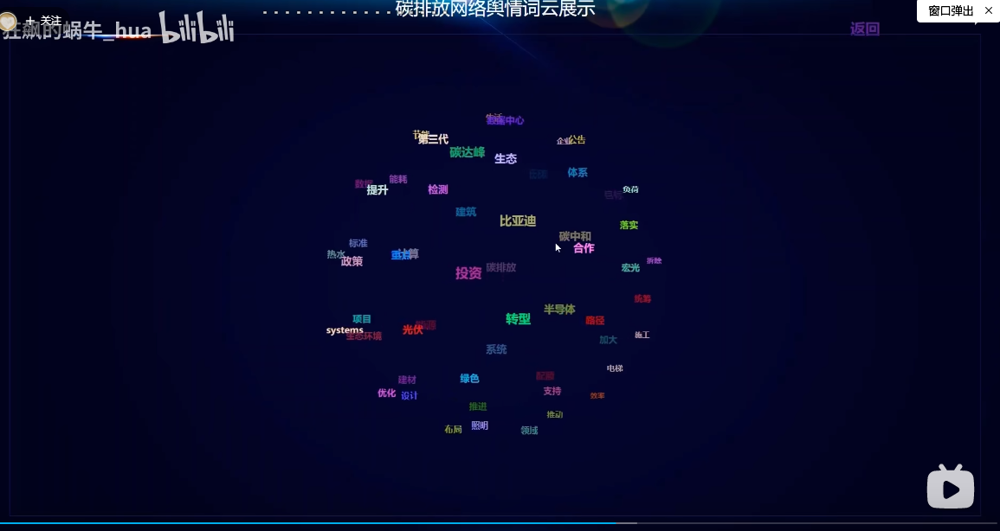

再加一个美食打卡的

这块我也是看别人的有感而发，感觉实现也不是很难，别人也是全屏就这个一个图

下面就是各个美食，峰值代表热度，图是echarts中的示例

数据可以模拟，而且我看了这个不需要什么数据，这个功能就叫旅游必吃

关于食物图标，我都处理好了，可以直接用

最后下面跳的美食热词就是3D词云，类似这种

至于词云的api，我也找到了，你看看能否使用，如有问题，及时反馈，

[echarts如何实现关键词云图 - 余情呀 - 博客园 (cnblogs.com)](https://www.cnblogs.com/yuqingya/p/13159077.html)

你看看这个功能可否行。

最后，感谢你嘉凯，谢谢你陪我走了这么远，以后有需要兄弟的，吱一声，我义不容辞