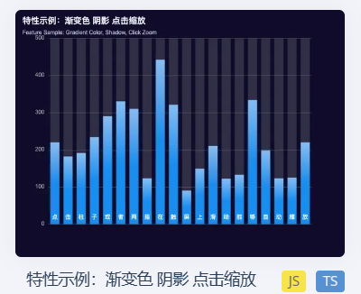
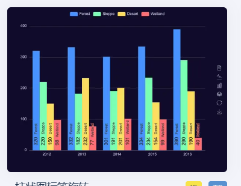
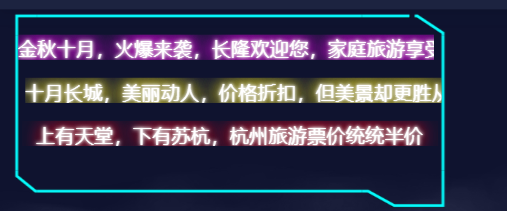

这个x轴为1到12个月份

y轴为当月最高的票价

总体展示的就是去年2022年的过去一年中哪个月份票价最高
***

柱体分别代表为2019年，2020年，2021年，2022年

y轴是景区票价

x轴为几个著名旅游景点，如故宫，拉萨，三亚，新宝岛，理塘顶针

***

这里来个价格折扣新闻，让消息从上往下滚动，模拟实时获取新闻
至于新闻我去旅游网站上搞一些固定文本，到时候每条循环就行了

***

具体政策
这里可以再搞一个3D词云，每点击一个词，就跳到对应省份的文化旅游局官网

