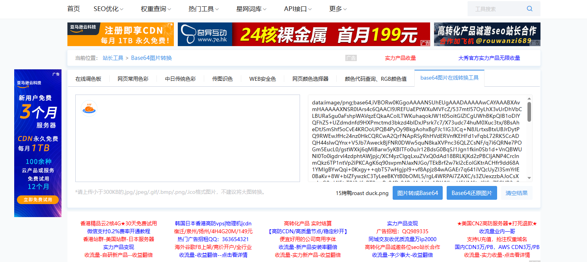

政策会议的图标我都找好了，可能尺寸上有些许差异，但是比你那个要稍微好点

然后那个政策主题那块是否太大了，区域分配的

不用搞那么大，右边可以在整一个图

感觉她这个国二的这个作品设计的就可以

这样，我们可以让让这些政策按列排，不不按行排

看了别人的，我觉得我们背景偏紫了，应该偏蓝的，紫主题真的没有蓝色那种科技感

当然，你这可能是区域背景块底色，其实背景是蓝的我知道，但是这个区域块底色可否换下，紫色属实没可视化那种科技感。

如下图示例

不是别的，主要是要有那种大屏的感觉，原谅我逼话那么多

这个是东八一楼的那个显示屏，个逼学校的大屏可视化都搞这个色，显得科技感

算了，我不说废话了，底色可以像那么蓝，凯哥息怒，我也是为了结果，多做好一点，就多一份机会，谁也不希望这段时间浪费，无论结果如何，尽力做好才无遗憾

