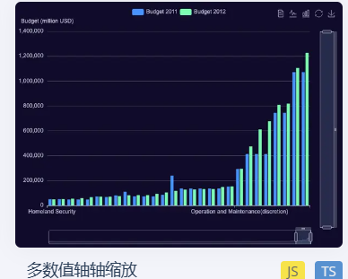

动态旅游景点排行榜，展示旅游名城动态排序效果

左边是各个旅游名城的名称，如北京，南京，上海，杭州，三亚

右边就是游客人次了
***

动态数据展示，因为这个图的数据是一直不断变化的，模拟动态拉取数据

x轴景点名称如长城，黄鹤楼，九寨沟

右边的y轴就是代表 折线上 各个景区票价

左边y轴也就是柱体高度为该景点的旅游评分，假设评分满分为5，柱体高度尽量都定在3.5以上，避免差距太大

***

蓝色柱体代表2022，绿色柱体为2023

所以y轴就是游客总人次数量

x轴为景区名称如：凤凰古城，丽江，桂林，西湖

***

中国各省份的景区的数量

蓝点大小代表该地景区的多少

绿点是几个旅游名城的坐标，当年游客总量越多，点子越大

***
下面是旅游推荐的子页面，高山流水和美食打卡

都是由旅游推荐跳链接过来的
因为旅游推荐顶部有两个button嘛

***
高山流水
就来个大屏动态词云，展示一些名山，好水，
点击词汇跳转相关页面有图片及简单介绍，只需要搞几个词能跳转就行，
录视频的时候也就操作这几个

美食打卡同上
来个3D词云，一些美食比如重庆火锅等等，也是搞几个跳转，
点击词汇，跳转到对应的简介和图片

***
你说的先展示具体省份，然后点击展示具体城市，想法非常妙
如果能实现就按你想的来

如果你觉得工作量大的话，我们可以只对其中3，4个做更改，录视频的时候就操作
改的那几个
