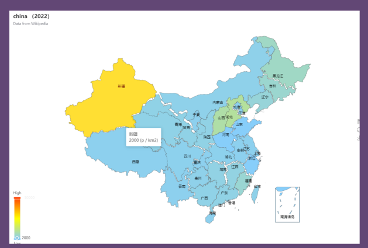
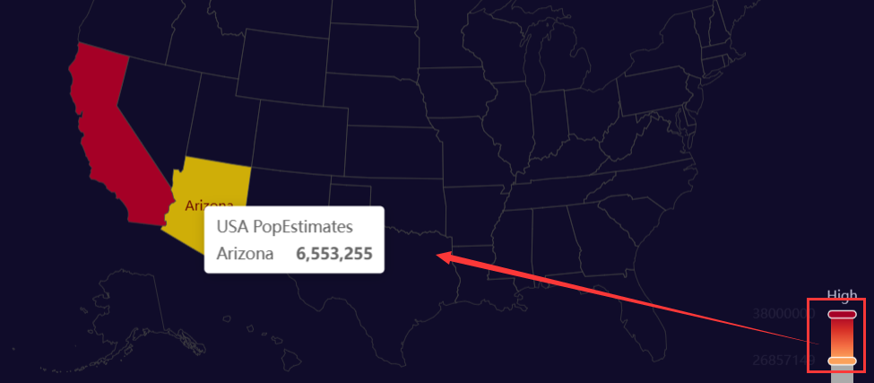
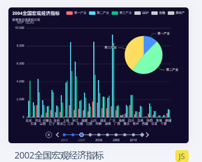
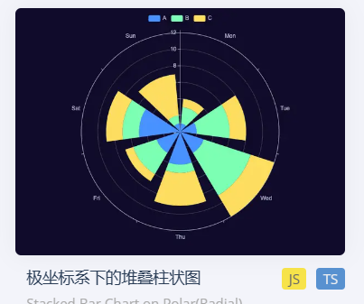
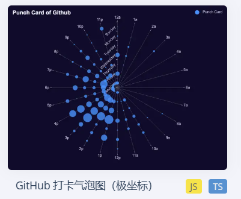

这里给换成了中国地图，左下角的颜色滑块，代表旅游热度，颜色越深热度越高，比如我把滑块拉到红色，就只有北京，江苏，新疆这几个省还亮着

如下图的样子

***
至于它对应的api和使用方式，我这里给出链接，链接比我说的详细

接口说明：
https://blog.csdn.net/weixin_45578530/article/details/124273089

下载地址：
https://gitcode.net/mirrors/liangrumeng2015/China.js?utm_source=csdn_github_accelerator

如果有问题，及时反馈
***

y轴是该省份的景区热度，x轴是具体省份，时间轴就和图中一样，只不过是从2020到2023

图中三种颜色柱体和饼图的三块区域含义一致的，分别为美食打卡，抖音团购，自驾游

饼图是跟着时间变化的，三块区域为美食打卡，抖音团购，自驾游

***

A,B,C 三个颜色分别代表年份2021，2022，2023

圆半径长度代表游客数

7个坐标区域代表7中旅游景区类型：传统文化， 历史古城，高岭名峰，生态湿地，著名美食，野生动物，海边度假

***

点大小代表人流量多少
圆半径代表1月到7月
极坐标为各名胜景区：
桂林，拉萨，西湖，丽江，三亚，长城，黄山，灵隐寺，颐和园，武当山，九寨沟，凤凰古城

中间那个地图柱状图变化可能无法实现

