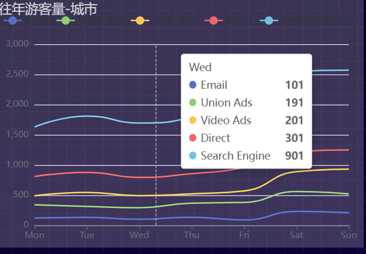
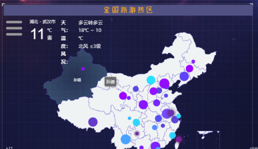
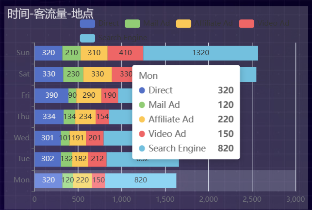
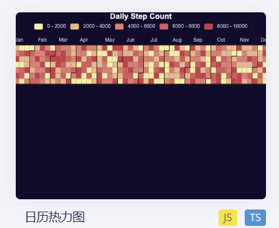
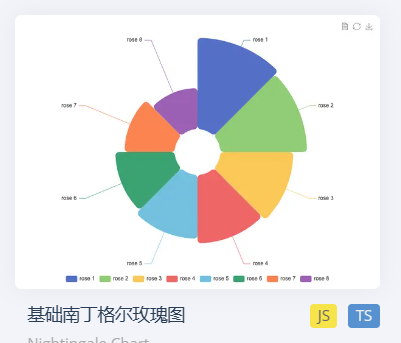
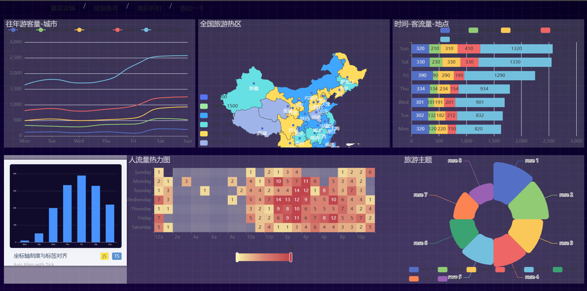

y轴：是游客量，单位为万

x轴：是几个著名旅游城市，如北京，江苏，新疆，海南，陕西，四川，西藏

曲线名称为2019 到 2023  
***

点的大小代表该地区的景区数量，景区越多，点子越大

点的颜色代表该地区的游客数据量，颜色越深，游客量越大

***

这个我不知道你设计的含义是什么，按你的想法来吧

***

展示从2023年到2024年的日历

颜色越深，游客人次越多，未来的日期就颜色为白
***

扇区名称为旅游人群分类：
亲子旅游，夫妻蜜月，公司团建，师生春游，网红打卡，个人旅游，闺蜜同游，抖音团购
比例大小随机设置就好
***

你觉得这样布局怎么样，不行就算了，按你的来，我审美并不咋样